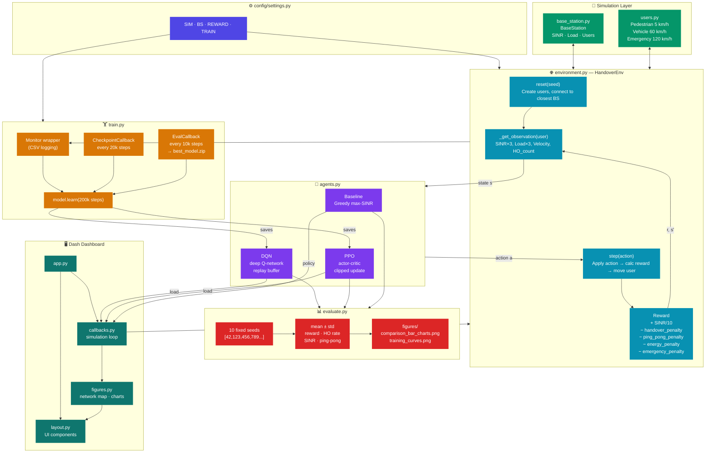

# System Architecture

```mermaid
flowchart TD
    subgraph CONFIG["⚙️ config/settings.py"]
        CFG[SIM · BS · REWARD · TRAIN]
    end

    subgraph ENV["🌐 environment.py — HandoverEnv"]
        direction TB
        RESET["reset(seed)\nCreate users, connect to closest BS"]
        OBS["_get_observation(user)\nSINR×3, Load×3, Velocity, HO_count"]
        STEP["step(action)\nApply action → calc reward → move user"]
        REWARD_CALC["Reward\n+ SINR/10\n− handover_penalty\n− ping_pong_penalty\n− energy_penalty\n− emergency_penalty"]
    end

    subgraph SIM_LAYER["📡 Simulation Layer"]
        BS["base_station.py\nBaseStation\nSINR · Load · Users"]
        USERS["users.py\nPedestrian 5 km/h\nVehicle 60 km/h\nEmergency 120 km/h"]
    end

    subgraph AGENTS["🤖 agents.py"]
        BASELINE["Baseline\nGreedy max-SINR"]
        DQN_M["DQN\ndeep Q-network\nreplay buffer"]
        PPO_M["PPO\nactor-critic\nclipped update"]
    end

    subgraph TRAIN["🏋️ train.py"]
        MONITOR["Monitor wrapper\n(CSV logging)"]
        CHECKPOINT["CheckpointCallback\nevery 20k steps"]
        EVALCB["EvalCallback\nevery 10k steps\n→ best_model.zip"]
        LEARN["model.learn(200k steps)"]
    end

    subgraph EVAL["📊 evaluate.py"]
        SEEDS["10 fixed seeds\n[42,123,456,789...]"]
        METRICS["mean ± std\nreward · HO rate\nSINR · ping-pong"]
        PLOTS["figures/\ncomparison_bar_charts.png\ntraining_curves.png"]
    end

    subgraph DASH["🖥️ Dash Dashboard"]
        APP["app.py"]
        LAYOUT["layout.py\nUI components"]
        CALLBACKS["callbacks.py\nsimulation loop"]
        FIGURES["figures.py\nnetwork map · charts"]
    end

    %% Config feeds everything
    CFG --> ENV
    CFG --> TRAIN

    %% Simulation layer
    BS <--> ENV
    USERS <--> ENV

    %% Training flow
    ENV --> MONITOR --> LEARN
    CHECKPOINT --> LEARN
    EVALCB --> LEARN
    LEARN -->|saves| DQN_M
    LEARN -->|saves| PPO_M

    %% Evaluation flow
    DQN_M --> EVAL
    PPO_M --> EVAL
    BASELINE --> EVAL
    SEEDS --> METRICS
    METRICS --> PLOTS

    %% RL loop
    OBS -->|state s| AGENTS
    AGENTS -->|action a| STEP
    STEP --> REWARD_CALC
    REWARD_CALC -->|r, s'| OBS
    RESET --> OBS

    %% Dashboard flow
    APP --> LAYOUT
    APP --> CALLBACKS
    CALLBACKS -->|step by step| ENV
    CALLBACKS --> FIGURES
    FIGURES --> LAYOUT

    %% Model loading into dashboard
    DQN_M -->|load| CALLBACKS
    PPO_M -->|load| CALLBACKS
    BASELINE -->|policy| CALLBACKS

    %% Styles
    classDef config fill:#4F46E5,color:#fff,stroke:none
    classDef env fill:#0891B2,color:#fff,stroke:none
    classDef sim fill:#059669,color:#fff,stroke:none
    classDef agent fill:#7C3AED,color:#fff,stroke:none
    classDef train fill:#D97706,color:#fff,stroke:none
    classDef eval fill:#DC2626,color:#fff,stroke:none
    classDef dash fill:#0F766E,color:#fff,stroke:none

    class CFG config
    class RESET,OBS,STEP,REWARD_CALC env
    class BS,USERS sim
    class BASELINE,DQN_M,PPO_M agent
    class MONITOR,CHECKPOINT,EVALCB,LEARN train
    class SEEDS,METRICS,PLOTS eval
    class APP,LAYOUT,CALLBACKS,FIGURES dash
```
